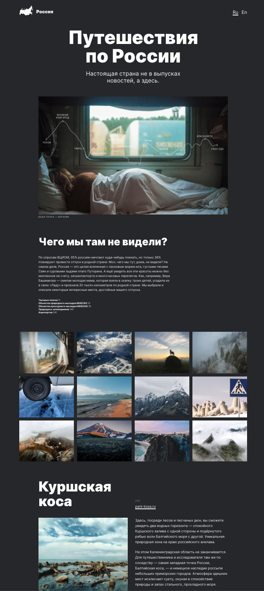

# Project: Traveling through Russia

---

## Description

 
The one-page website 'Traveling through Russia' tells about the best places to travel in Russia.

### :arrow_right: Links to test

 
https://milasergeeva.github.io/russian-travel/index.html

## :hammer_and_pick:Technologies

 
The following tecnologies were used to create this project:

- HTML

- CSS
  Flex and Grid were used for positioning objects;
  Adaptive layout (breaking point:
  320px,
  768px,
  1024px,
  1280px. )

- BEM notation

The project uses links to third-party resources to obtain additional information.
Links opening in a new browser tab.

### Preview

 
 
